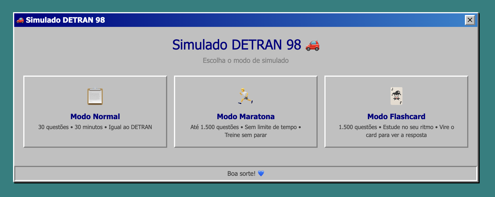
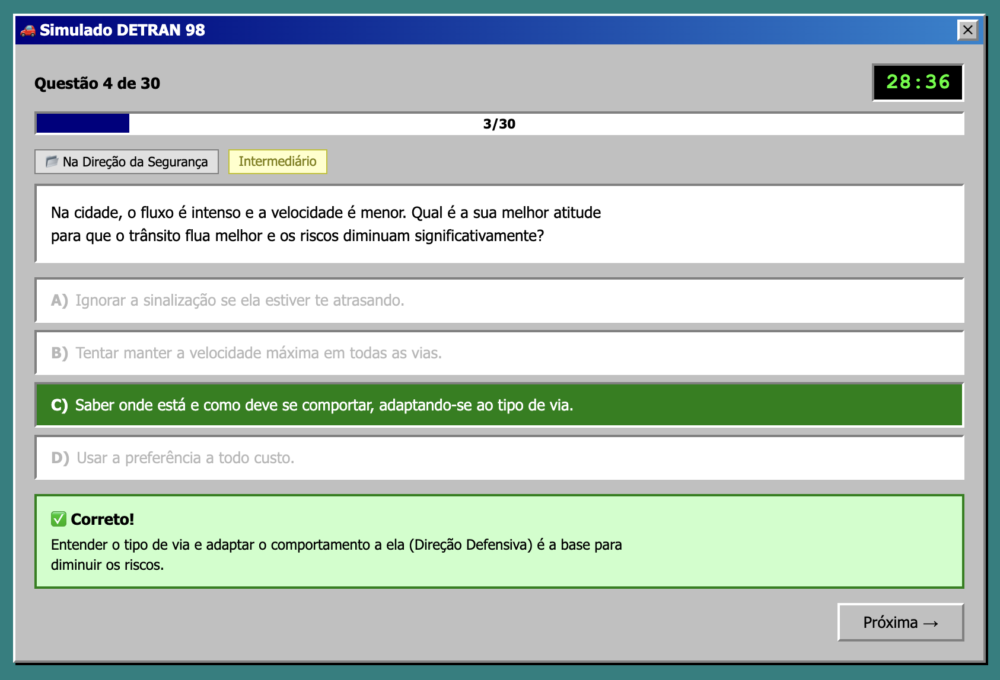
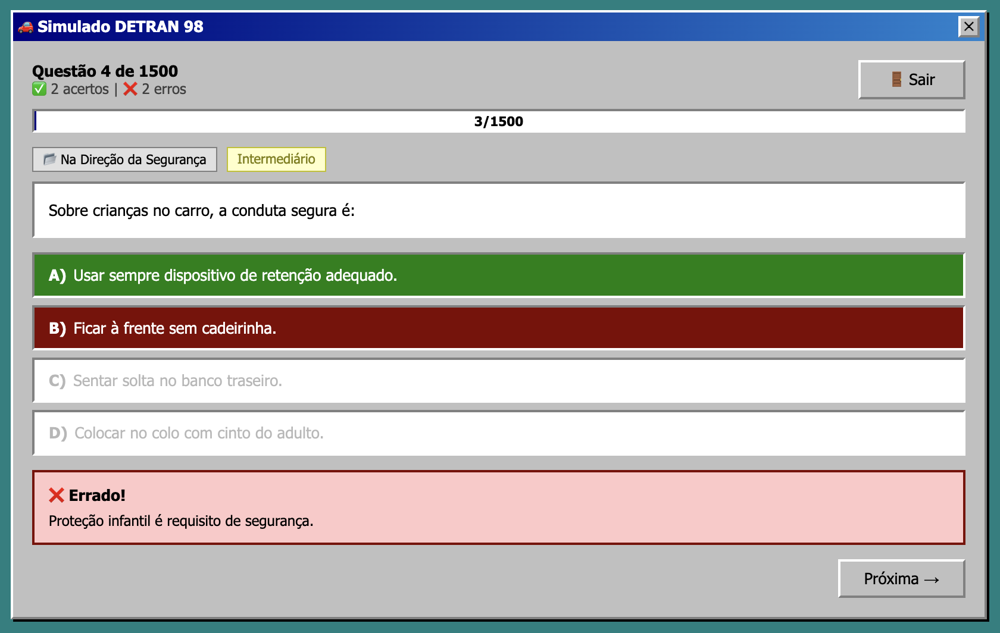
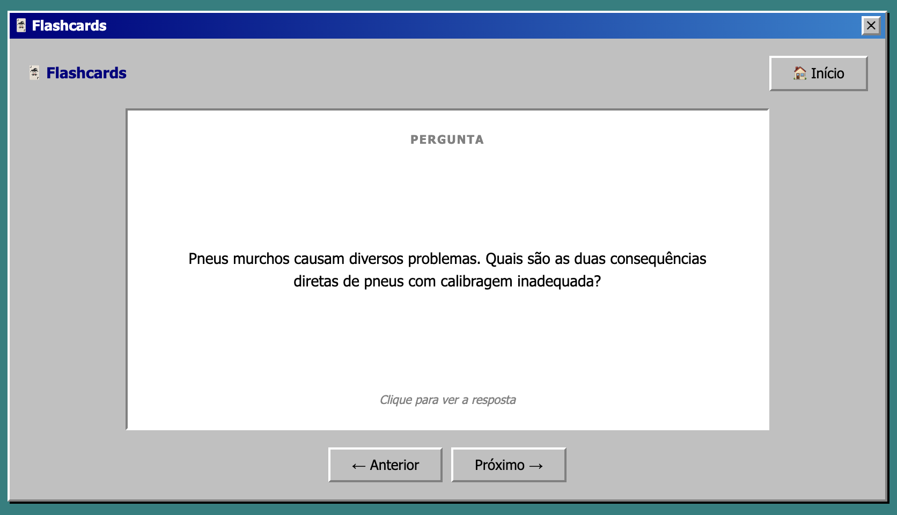

# Simulado DETRAN 98 🚗

Simulador da prova teórica do DETRAN com tema visual **Windows 98**. Aplicação web single-page, sem backend, sem dependências externas.



## Estrutura do Projeto

```
├── index.html              ← aplicação principal (HTML puro)
├── css/
│   └── style.css           ← todos os estilos
├── js/
│   ├── state.js            ← estado global + utilitários (shuffle, telas, modais, teclado)
│   ├── questions.js        ← carregamento, seleção, montagem de alternativas
│   ├── timer.js            ← lógica do timer
│   ├── quiz.js             ← renderizar questão, selecionar, confirmar, próxima
│   ├── modes.js            ← startNormalMode, startMarathonMode, startFlashcardMode
│   ├── flashcard.js        ← lógica do modo flashcard (flip, navegação)
│   └── result.js           ← showResult, goHome, gabarito, estatísticas
├── data/
│   └── questions.json      ← banco de 1.500 questões
├── docs/
│   └── *.png               ← screenshots para o README
├── init_scripts/
│   ├── run.sh              ← script para rodar localmente (Linux/macOS)
│   └── run.ps1             ← script para rodar localmente (Windows/PowerShell)
├── AGENTS.md               ← documento de especificação técnica
└── README.md               ← este arquivo
```

## Banco de Questões

- **Total:** 1.500 questões
- **Dificuldades:** Fácil (743), Intermediário (533), Difícil (224)
- **Módulos:**
  1. Placas, Cores e Caminhos — 412 questões
  2. Escolhas e Consequências — 205 questões
  3. Na Direção da Segurança — 623 questões
  4. Cuidar, Agir e Preservar — 260 questões

## Modos de Uso

### 📋 Modo Normal
- 30 questões (7 fáceis + 10 intermediárias + 13 difíceis)
- Timer de 30 minutos (igual ao DETRAN)
- Aprovação: ≥ 21 acertos (70%)
- Feedback imediato com comentário após cada resposta



### 🏃 Modo Maratona
- Até 1.500 questões embaralhadas
- Sem limite de tempo
- Placar ao vivo (acertos/erros)
- Botão "Sair" com confirmação e resultado parcial



### 🃏 Modo Flashcard
- 1.500 questões para estudo livre
- Clique no card para virar e ver a resposta
- Navegação com botões ou setas do teclado
- Sem pontuação — foco em aprender



## Resultado Detalhado

Após cada simulado (Normal ou Maratona), a tela de resultado exibe:

- **Nota e percentual** geral
- **Estatísticas por dificuldade** — barras visuais mostrando desempenho em Fácil, Intermediário e Difícil
- **Gabarito completo** — modal expansível com todas as questões respondidas, sua resposta, a correta e o comentário

## Como Rodar

### Pré-requisitos
- Python 3

### Linux e macOS
```bash
./init_scripts/run.sh
```

### Windows (PowerShell)
```powershell
.\init_scripts\run.ps1
```

### Manual
```bash
cd simulator-98-detran
python3 -m http.server 8080
```

Depois abra: **http://localhost:8080**

> ⚠️ Não abra o `index.html` diretamente no navegador (`file://`). O `fetch('data/questions.json')` será bloqueado pelo CORS. Use sempre o servidor local.

## Funcionalidades

- **Tema Windows 98** — bordas biseladas, paleta clássica, tipografia fiel
- **Timer progressivo** — verde → amarelo (< 5min) → vermelho piscando (< 1min)
- **Atalhos de teclado:**
  - `Enter` — confirma resposta / avança para próxima / vira flashcard
  - `↑` / `↓` — navega entre alternativas
  - `←` / `→` — navega entre flashcards
- **Modais de confirmação** ao fechar a janela ou sair da maratona
- **Responsivo** — funciona em desktop e mobile

## Tecnologias

HTML + CSS + JavaScript vanilla (raiz)!

## Créditos

As 1.500 questões foram extraídas do projeto [teorical-questions-detran](https://github.com/oprimodev/teorical-questions-detran) do [@oprimodev](https://github.com/oprimodev).

---

- Feito utilizando opencode, modelos Opus 4.7 (plan) + Qwen3.6 Plus (exec)
